```mermaid
flowchart LR
    A[크롤링<br>crawling/CreditCardCrawling.py] --> B[카드 JSON 저장<br>crawling/cards/]
    B --> C[임베딩 처리<br>embedding/EmbeddingCardInfo.py]
    C --> D[FAISS DB 생성<br>embedding/faiss_card_db/]

    D --> E[추천 시스템 초기화<br>recommendation/recommender.py]
    E --> F[사용자 쿼리 입력<br>test.py]
    F --> G[유사도 기반 검색<br>FAISS]
    G --> H[카드 필터링<br>query_filter.py]
    H --> I[카드 문서 포맷팅<br>formatter.py]
    I --> J[프롬프트 구성<br>prompt_builder.py]
    J --> K[LLM 응답 생성<br>GPT-4]
    K --> L[추천 결과 출력<br>Top 3 카드]

    style A fill:#dfefff,stroke:#0077cc
    style C fill:#dfffdc,stroke:#339933
    style E fill:#ffe4e4,stroke:#cc0000
    style K fill:#fff2cc,stroke:#ffaa00
```

# 신용카드 챗봇 시스템

## 개요

## 프로젝트 소개

사용자의 소비 성향과 원하는 혜택에 따라 최적의 신용카드를 추천하는 RAG 기반 AI 챗봇입니다.  
질문 한 줄만으로 방대한 카드 혜택 정보를 요약하고 비교해, 빠르고 정확한 카드 선택을 돕습니다.

## 프로젝트 필요성

수많은 카드사와 혜택이 혼재된 시장에서 소비자는 자신에게 맞는 카드를 찾기 어려운 상황입니다.  
공식 홈페이지나 블로그, 광고 정보는 분산되어 있어 객관적인 비교가 어렵고, 소비자 입장에서 실질적인 정보 접근성도 낮습니다.  
특히 특정 혜택(예: 주유, 해외 결제, 스트리밍 할인 등)을 중점적으로 비교하고자 할 때, 신뢰할 수 있는 정보 제공 시스템의 부재가 문제가 되고 있습니다.

이에 따라, 신용카드 혜택 정보를 통합 수집하고 사용자의 질문에 맞춰 맞춤형으로 추천해주는 AI 기반 챗봇의 필요성이 대두되고 있습니다.

## 프로젝트 목표

- 카드 혜택, 연회비, 발급 조건 등 다양한 정보를 통합적으로 제공하는 신용카드 추천 챗봇을 구축합니다.  
- RAG(Retrieval-Augmented Generation) 구조를 기반으로, 문서 검색과 LLM 응답 생성을 결합하여 사용자 질문에 정확한 답변을 제공합니다.  
- LangChain 기반 파이프라인을 통해 크롤링, 전처리, 벡터화, 검색, 응답 생성을 체계화하고, RAGAS 지표를 활용해 성능을 정량적으로 평가합니다.  
- 사용자 신뢰도 확보를 위해 카드 상세 페이지 링크와 혜택 출처 정보를 함께 제공합니다.  
- 누구나 쉽게 접근 가능한 웹 인터페이스와 챗봇 구조를 통해 카드 정보 탐색의 진입 장벽을 낮추고, 소비자 선택을 돕습니다.

## 시스템 아키텍처

### 📁 모듈화된 프로젝트 구조

```
beomseok/
├── crawling/                    # 데이터 수집 모듈
│   ├── CreditCardCrawling.py   # 카드 정보 크롤링
│   ├── cards/                  # 크롤링된 카드 JSON 파일들
│   └── __init__.py
├── embedding/                   # 임베딩 처리 모듈
│   ├── EmbeddingCardInfo.py    # 카드 정보 임베딩 처리
│   ├── faiss_card_db/          # FAISS 벡터 데이터베이스
│   └── __init__.py
├── recommendation/              # 추천 시스템 모듈
│   ├── model_manager.py        # 임베딩 모델, LLM, FAISS 로딩
│   ├── query_filter.py         # 사용자 쿼리에서 필터 추출 및 문서 필터링
│   ├── formatter.py            # 문서 → 프롬프트 입력 변환
│   ├── prompt_builder.py       # 프롬프트 템플릿만 관리
│   ├── recommender.py          # RAG 체인 구성 및 실행
│   ├── example_usage.py        # 사용 예제
│   └── __init__.py
├── evaluation/                  # 평가 모듈
│   ├── RAG_Evaluation.py       # RAG 시스템 성능 평가
│   ├── RAG_Evaluation_Report.py # 평가 결과 보고서 생성
│   ├── reports/                # 평가 결과 리포트들
│   └── __init__.py
├── test.py                     # CLI 인터페이스 (메인 실행 파일)
└── ChatbotReport.md            # 프로젝트 문서
```

### 🔧 모듈별 역할

#### 1. crawling/ - 데이터 수집
- **CreditCardCrawling.py**: 카드 고릴라에서 카드 정보 크롤링
- **cards/**: 크롤링된 카드 JSON 파일 저장소

#### 2. embedding/ - 임베딩 처리
- **EmbeddingCardInfo.py**: 카드 JSON → 벡터 임베딩 및 FAISS DB 저장
- **faiss_card_db/**: FAISS 벡터 데이터베이스

#### 3. recommendation/ - 추천 시스템
- **model_manager.py**: 임베딩 모델, LLM, FAISS 로딩 및 관리
- **query_filter.py**: 사용자 쿼리에서 필터 조건 추출 및 문서 필터링
- **formatter.py**: 검색된 문서를 프롬프트용으로 포맷팅
- **prompt_builder.py**: LLM 프롬프트 템플릿 관리
- **recommender.py**: RAG 체인 구성 및 실행 (메인 시스템)

#### 4. evaluation/ - 성능 평가
- **RAG_Evaluation.py**: RAGAS 기반 성능 평가
- **RAG_Evaluation_Report.py**: 평가 결과 보고서 생성

---

## 시스템 구성

### 1) 데이터 수집 (크롤링)

카드 고릴라의 카드 정보 페이지를 `card_id` 기반으로 순차적으로 접근하여 신용카드의 정보를 크롤링합니다.  
`card_id`를 통한 URL이 있더라도 카드 정보가 없는 URL은 skip합니다.(약 85개)  
카드의 발급 유무 정보를 담고 있는 class=`inactive`의 경우 발급이 불가한 경우만 확인할 수 있습니다.  
그러므로 class=`inactive`가 없는 경우 `inactive=False`로 부여하여 전처리를 진행했습니다.  
데이터 크롤링 시 이후에 진행할 데이터 임베딩을 위해 크롤링 후 JSON 형식으로 저장하게끔 했습니다.

다음은 크롤링된 카드 정보의 전처리 항목 정의입니다.

#### 카드 기본 정보

| 항목명                      | 설명                             | 데이터 타입     | 처리 방식 / 비고 |
|---------------------------|----------------------------------|----------------|------------------|
| `card_id`                 | 카드 고유 ID                      | Integer        | URL에서 추출, 카드 식별용 |
| `card_url`                | 카드 상세 페이지 URL              | String         | `https://www.card-gorilla.com/card/detail/{card_id}` 형식 |
| `card_name`               | 카드 이름                         | String         | HTML `.tit .card` 요소에서 추출 |
| `issuer`                 | 카드사 이름                        | String         | HTML `.brand` 클래스에서 추출 |
| `inactive`                | 발급 가능 여부                    | Boolean/String | `class="inactive"` 존재 시 True, 없으면 `False` 지정 |
| `brands`                  | 카드 브랜드 목록                   | List[String]   | `.c_brand span` 텍스트 리스트 |
| `annual_fee`              | 연회비 (국내/해외)                 | Dict           | `{domestic: ~, international: ~}` 구조 |
| `required_spending`       | 전월 실적 조건 설명                | String         | "전월 실적" 항목에서 텍스트 추출 |
| `required_spending_amount`| 실적 조건 금액 (숫자형)            | Integer/Null   | 텍스트에서 숫자만 정규표현식으로 추출 |

#### 혜택 정보

| 항목명              | 설명                     | 데이터 타입     | 처리 방식 / 비고 |
|-------------------|--------------------------|----------------|------------------|
| `benefits`        | 혜택 정보 전체 목록        | List[Object]   | 각 `dl` 블록에서 분리 추출 |
| `benefit.type`    | 혜택 분류 유형             | String         | `dt .txt1` 요소 |
| `benefit.summary` | 혜택 요약 설명             | String         | `dt i` 요소 |
| `benefit.details` | 혜택 상세 내용 리스트       | List[String]   | `dd > div > p` 텍스트 리스트 |

#### 유의사항

| 항목명     | 설명               | 데이터 타입     | 처리 방식 / 비고 |
|------------|--------------------|------------------|------------------|
| `cautions` | 유의사항 텍스트 목록 | List[String]     | "유의사항" 텍스트 포함 여부 기반 추출 |

### 2) 데이터 임베딩

카드 JSON 파일들을 LangChain의 `Document` 객체로 변환하여, 카드별로 다양한 정보를 구조화해 임베딩합니다.

- **카드 기본 정보**  
  카드명, 카드사, 연회비, 브랜드, 발급여부 등 핵심 메타데이터를 포함한 단일 Document로 생성

- **혜택 및 유의사항 분리 임베딩**  
  각 카드의 혜택(benefit)과 유의사항(caution)을 개별 Document로 분리하여 저장  
  혜택은 type(카테고리), summary(요약), details(상세)로 세분화  
  유의사항도 각각 별도의 Document로 저장하여, 검색 시 세밀한 필터링이 가능

- **메타데이터 활용**  
  각 Document에는 카드사, 카드명, 연회비, 브랜드, content_type(benefit/caution 등) 등 다양한 메타데이터가 포함되어  
  검색 및 필터링, 추천 시스템에서 유연하게 활용

- **임베딩 모델**  
  KoSimCSE(BM-K/KoSimCSE-roberta-multitask) 모델을 Hugging Face Hub에서 로딩하여  
  모든 Document를 벡터로 임베딩  
  GPU(CUDA) 환경에서 batch 단위로 임베딩을 수행하여 대용량 데이터도 빠르게 처리

- **FAISS 벡터DB 저장**  
  임베딩된 Document 벡터는 FAISS DB에 저장  
  약 17,000개 이상의 카드 관련 Document가 벡터DB에 저장되어,  
  빠르고 정확한 유사도 검색이 가능

- **임베딩 파이프라인 자동화**  
  카드 JSON 파일 수집 → Document 변환 → 임베딩 → FAISS 저장까지  
  전체 파이프라인이 자동화되어, 신규 데이터 추가/갱신도 쉽게 처리 가능

### 3) 추천 시스템 (RAG 체인)

신용카드 추천 RAG 파이프라인은 모듈화된 구조로 다음과 같이 구성됩니다:

```python
# recommendation/recommender.py
self.rag_chain = (
    RunnableLambda(self._retrieve_and_filter_docs)
    | RunnableLambda(self._format_docs_for_prompt)
    | PromptBuilder.create_recommendation_prompt()
    | self.model_manager.llm
    | StrOutputParser()
)
```

#### 모듈별 역할

1. **model_manager.py** - 모델 관리
   - 임베딩 모델 (KoSimCSE) 초기화
   - LLM (OpenAI GPT-4) 초기화
   - FAISS 벡터DB 로딩

2. **query_filter.py** - 쿼리 필터링
   - 사용자 쿼리에서 필터 조건 추출 (카드사, 브랜드, 연회비 등)
   - 메타데이터 기반 문서 필터링

3. **formatter.py** - 문서 포맷팅
   - 검색된 카드 문서를 프롬프트용으로 변환
   - 카드 정보 구조화

4. **prompt_builder.py** - 프롬프트 관리
   - 시스템 프롬프트 템플릿 생성
   - 사용자 질문과 카드 정보 결합

5. **recommender.py** - RAG 체인 실행
   - 전체 RAG 파이프라인 구성 및 실행
   - 싱글톤 패턴으로 시스템 인스턴스 관리

#### 체인 전체 흐름

- 사용자의 질문 입력  
→ 벡터DB에서 관련 카드 문서 검색 및 필터링  
→ 카드 정보 포맷팅  
→ LLM 프롬프트 생성  
→ LLM을 통한 답변 생성  
→ 최종 추천 결과 반환

### 4) CLI 인터페이스

**test.py**에서 사용자 친화적인 CLI 인터페이스를 제공합니다:

```python
# 사용 예시
python test.py

# 대화형 인터페이스
사용자 질문을 입력하세요 (종료: quit): 주유 혜택이 많은 카드 추천해줘
사용자 질문을 입력하세요 (종료: quit): 신한카드 중에서 외식 혜택 좋은 카드
사용자 질문을 입력하세요 (종료: quit): 연회비 5만원 이하 카드 추천
```

### 5) RAG 성능 평가

RAG 시스템의 성능은 다음과 같은 주요 평가 지표로 측정합니다:

- **정합성 (faithfulness)**: 생성된 답변이 실제로 검색된 컨텍스트(근거)에 기반하여 생성되었는지의 비율을 나타냅니다. 값이 높을수록 답변이 근거에 충실함을 의미합니다.
- **정답 관련성 (answer_relevancy)**: 생성된 답변이 사용자의 질문에 얼마나 적절하게 부합하는지를 평가합니다. 값이 높을수록 질문에 맞는 답변임을 의미합니다.
- **컨텍스트 재현율 (context_recall)**: 검색된 컨텍스트가 실제로 정답에 필요한 모든 정보를 포함하고 있는지 평가합니다. 1.0에 가까울수록 필요한 근거를 모두 찾았음을 의미합니다.
- **컨텍스트 정밀도 (context_precision)**: 검색된 컨텍스트 중 실제로 정답에 필요한 정보만을 얼마나 정확히 포함하고 있는지 평가합니다. 1.0에 가까울수록 불필요한 정보 없이 정확함을 의미합니다.
- **의미 유사도 (semantic_similarity)**: 생성된 답변과 정답(근거) 간의 의미적 유사도를 측정합니다. 값이 높을수록 두 텍스트가 의미적으로 비슷함을 의미합니다.

#### 최신 RAGAS 평가 결과  

**평가 환경:**
- 평가 방법: RAGAS (RAG Assessment) 프레임워크
- 평가 데이터: Synthetic 평가 세트 (10개 샘플)
- 평가 모델: klue/roberta-base 토크나이저
- 평가 시간: 약 203초

**평가 지표 결과:**
```
==================== RAGAS 평가 지표 ====================
  정합성 (faithfulness): 0.5538
정답 관련성 (answer_relevancy): 0.8284
컨텍스트 재현율 (context_recall): 1.0000
컨텍스트 정밀도 (context_precision): 1.0000
의미 유사도 (semantic_similarity): 0.9003
========================================================
```

#### 상세 성능 분석

**우수한 성능 지표:**
- **컨텍스트 재현율 (context_recall)**: 1.0000 - 검색 시스템이 관련된 모든 정보를 완벽하게 찾아내고 있음
- **컨텍스트 정밀도 (context_precision)**: 1.0000 - 검색된 정보가 모두 관련성이 높아 불필요한 정보 없이 정확함
- **의미 유사도 (semantic_similarity)**: 0.9003 - 생성된 답변이 참조 답변과 의미적으로 매우 유사함

**개선이 필요한 지표:**
- **정합성 (faithfulness)**: 0.5538 - 생성된 답변이 제공된 컨텍스트에 충실한 정도가 보통 수준
- **정답 관련성 (answer_relevancy)**: 0.8284 - 답변이 질문과의 관련성이 양호하지만 더 개선 가능

#### 종합 평가 및 개선 방안

**시스템 강점:**
1. **검색 성능 우수**: FAISS 벡터DB와 KoSimCSE 임베딩 모델의 조합으로 관련 정보 검색이 매우 정확함
2. **의미적 일관성**: 생성된 답변이 참조 답변과 높은 의미적 유사도를 보임
3. **정보 완성도**: 필요한 모든 정보를 빠짐없이 검색하여 제공
4. **모듈화된 구조**: 각 기능이 독립적인 모듈로 분리되어 유지보수성과 확장성이 우수함

**개선 방안:**
1. **프롬프트 엔지니어링 개선**: 
   - 컨텍스트 기반 답변 생성을 강화하는 프롬프트 설계
   - 근거 인용 및 출처 명시를 위한 프롬프트 추가
   
2. **LLM 파라미터 최적화**:
   - temperature 조정으로 더 일관된 답변 생성
   - max_tokens 설정으로 적절한 답변 길이 제어
   
3. **컨텍스트 전처리 강화**:
   - 검색된 컨텍스트의 품질 검증 로직 추가
   - 중복 정보 제거 및 중요도 기반 정렬

4. **답변 검증 시스템**:
   - 생성된 답변의 컨텍스트 기반성 검증
   - 사용자 피드백 수집 및 반영 시스템

**실사용 적합성:**
현재 시스템은 실사용에 충분한 수준의 성능을 보이며, 특히 정보 검색과 의미적 일관성 측면에서 우수한 성능을 발휘합니다. 모듈화된 구조로 인해 각 기능의 독립적인 개선과 확장이 용이하며, 위의 개선 방안을 단계적으로 적용할 것을 권장합니다.

---

## 사용 방법

### 1. 시스템 실행

```bash
# CLI 인터페이스 실행
python test.py

# 또는 추천 시스템만 사용
from recommendation.recommender import get_recommendation_system
system = get_recommendation_system()
result = system.recommend_cards("주유 혜택이 많은 카드 추천해줘")
```

### 2. 모듈별 실행

```bash
# 크롤링 실행
cd crawling
python CreditCardCrawling.py

# 임베딩 실행
cd embedding
python EmbeddingCardInfo.py

# 평가 실행
cd evaluation
python RAG_Evaluation.py
```

### 3. 필터링 옵션

- **카드사 필터링**: "신한카드 중에서 외식 혜택 좋은 카드"
- **카드명 필터링**: "삼성 iD ON 카드 추천"
- **연회비 필터링**: "연회비 5만원 이하 카드 추천"
- **브랜드 필터링**: "VISA 브랜드 카드 중에서 온라인 쇼핑 혜택 좋은 카드"

---


